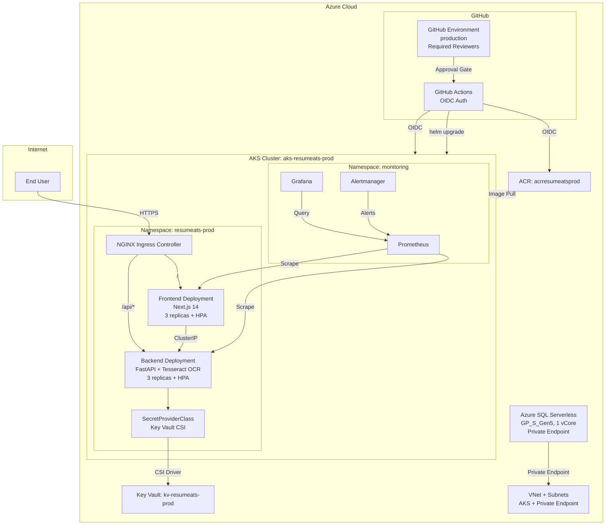

# Architecture — Resume-ATS Production

## Overview

Resume-ATS is a stateless ATS resume analyzer: users upload a PDF/DOCX resume, the backend parses and scores it, and the frontend displays the results. The production deployment runs on Azure Kubernetes Service (AKS) with NGINX ingress, Azure Container Registry (ACR), Azure Key Vault, and Azure SQL.

## Architecture Diagram

## Component Justifications

### Why NGINX Ingress (not AGIC)
- **NGINX** is the most widely used Kubernetes ingress controller with extensive community support, documentation, and Helm chart maturity.
- **AGIC** (Azure Application Gateway Ingress Controller) ties you to Azure-specific resources, has fewer features, and is less portable.
- NGINX supports standard Kubernetes Ingress resources, making the cluster configuration cloud-agnostic and easier to debug.
- The official `ingress-nginx` Helm chart is well-maintained and follows KISS.

### Why Azure Container Registry (not Docker Hub)
- **ACR** provides geo-replication, private endpoints, and integrated managed identity for AKS image pulls.
- No external dependencies — images stay within the Azure subscription boundary.
- ACR Pull role is assigned to the AKS managed identity via Terraform — no admin credentials or Docker Hub tokens needed.

### Why GitHub Actions OIDC (not static credentials)
- **OIDC federated identity** eliminates the need for long-lived client secrets.
- GitHub Actions requests a short-lived token from Azure AD for each workflow run.
- The Terraform `github-oidc` module creates an Azure AD App Registration with federated credentials scoped to the `production` environment and `main` branch.
- No secrets to rotate, no credentials to leak.

### AKS Node Pool Design
- **System pool** (`Standard_B2s`, 2 vCPU / 4 GiB): runs critical system pods (CoreDNS, metrics-server, kube-proxy). Autoscales 1–2 nodes. Kept small to minimize cost.
- **User pool** (`Standard_B2ms`, 2 vCPU / 8 GiB): runs application workloads. Autoscales 2–4 nodes. The larger memory (8 GiB vs 4 GiB) provides headroom for Tesseract OCR spikes, which convert PDF pages to 300 DPI images before OCR — a memory-intensive operation.
- **Azure CNI** is used for per-pod IP allocation and better network isolation (vs kubenet).

### Azure SQL Serverless — Provisioned but Not Yet Used
> **⚠️ Flagged Open Item:** The Resume-ATS application is currently **stateless** — `POST /api/analyze` processes resumes in-memory with no database calls. Azure SQL is provisioned per the rubric requirement but is **not connected to the application**.

- **SKU:** `GP_S_Gen5` (General Purpose Serverless Gen5), 1 vCore minimum, auto-pause after 60 minutes of inactivity.
- **Security:** Public network access is disabled. A private endpoint connects the SQL server to the VNet, making it reachable only from within the AKS subnet.
- **Password:** Generated by Terraform (`random_password`), stored in Key Vault, never in plaintext.
- **Future use:** The team may add a lightweight persistence feature (e.g., saving analysis results, user history) in a separate, explicitly-approved task. That would require modifying `backend/app/`, which is off-limits in this phase. Until then, SQL is available but unused.

### Why Single Production Environment (not staging + production)
> **⚠️ Deliberate Trade-off:** The rubric describes a two-stage approval gate (staging → production). We deliberately chose a **single production environment** for time reasons.

- A single GitHub `production` environment with **required reviewers** still satisfies the "protected approvals" requirement — every deployment to production requires human approval.
- We do **not** have a separate staging cluster or namespace. This is a conscious decision to reduce infrastructure complexity and cost for a university capstone project with a tight timeline.
- **Risk mitigation:** PR-triggered CI workflows (build + test + Trivy scan) act as a pre-merge quality gate. The `terraform plan` on PRs (posted as a comment) provides review before any infrastructure change. The approval gate on `main` ensures no deployment happens without human review.
- If the team later needs a staging environment, the Terraform modules and Helm charts are parameterized to support additional environments with minimal changes.

### Key Vault + CSI Secret Store Driver
- All secrets (SQL admin password, future API keys) are stored in **Azure Key Vault** — never in plaintext, never in Git, never in Helm values.
- The **CSI Secret Store driver** mounts secrets directly into pods as files or environment variables at runtime.
- The `SecretProviderClass` template in both Helm charts is ready to use — just enable it in `values-production.yaml` and set the Key Vault name + tenant ID.
- No Kubernetes Secrets with plaintext values are created manually.

### Least-Privilege RBAC
- Each service (frontend, backend) has its own **ServiceAccount** with a **Role** scoped to only `get`, `list`, `watch` on pods and configmaps in the `resumeats-prod` namespace.
- No `cluster-admin` or broad permissions are granted to any application workload.
- The AKS cluster uses Azure RBAC (Kubernetes RBAC + Azure AD integration).

### NetworkPolicies
- **Default deny:** The base `network-policies.yaml` denies all ingress and egress by default.
- **Frontend:** Allows ingress from the NGINX ingress controller (any namespace) on port 3000.
- **Backend:** Allows ingress **only** from frontend pods (labeled `app.kubernetes.io/name: frontend`) on port 8000. No other pod or external source can reach the backend.
- This ensures the backend is never directly exposed — all traffic must flow through the frontend → backend path.

### Image Tag Immutability
- All container images are tagged with the **git commit SHA** — never `:latest`.
- ACR admin access is disabled; only the AKS managed identity and GitHub Actions OIDC identity can push/pull.
- Trivy image scanning in both CI and CD pipelines blocks deployment on `CRITICAL` or `HIGH` vulnerabilities.

## Resource Summary

| Resource | Name | SKU/Size |
|----------|------|----------|
| Resource Group | `rg-resumeats-prod` | — |
| AKS Cluster | `aks-resumeats-prod` | — |
| System Node Pool | `system` | Standard_B2s, 1–2 nodes |
| User Node Pool | `user` | Standard_B2ms, 2–4 nodes |
| ACR | `acrresumeatsprod` | Basic |
| Key Vault | `kv-resumeats-prod` | Standard |
| Azure SQL Server | `sql-resumeats-prod` | — |
| Azure SQL Database | `sqldb-resumeats-prod` | GP_S_Gen5, 1 vCore, auto-pause 60m |
| VNet | `vnet-resumeats-prod` | 10.0.0.0/16 |
| AKS Subnet | `aks-subnet` | 10.0.1.0/24 |
| Private Endpoint Subnet | `private-endpoint-subnet` | 10.0.2.0/24 |
| Log Analytics | `log-resumeats-prod` | — |
| GitHub OIDC App | `github-actions-resumeats-prod` | — |